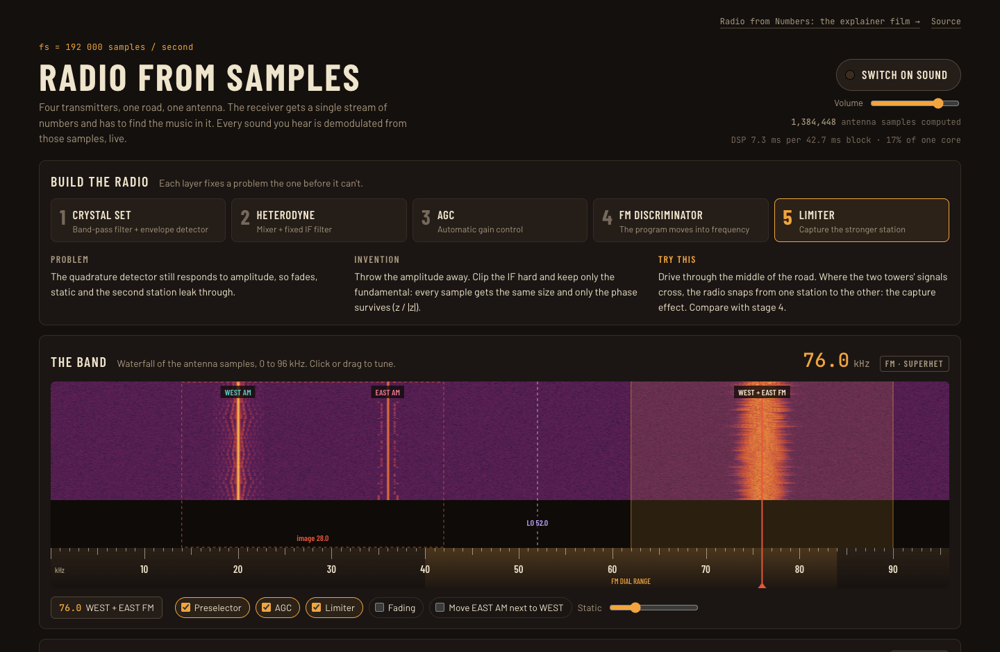

# Radio from Samples

A software AM/FM radio that runs in the browser: four transmitters, a road between two towers, and a receiver that demodulates every sound from 192 000 samples per second.

**Live:** https://neurabytelabs.github.io/radio/
**Explainer film:** https://neurabytelabs.github.io/radio/numbers/



## What is in here

| Page | What it is |
| --- | --- |
| [`index.html`](index.html) (Samples) | The radio. Pick a receiver stage, tune on the waterfall, drag the car between the towers, zoom from the block diagram down to single filter taps. |
| [`numbers/`](numbers/) (Numbers) | *Radio from Numbers*, an 89-second explainer film with storyboard, character sheet and captions. |

## How it works

Everything is computed in a Web Worker, one 8192-sample block (42.7 ms) at a time.

1. **Programs.** Four signals are synthesized at 48 kHz: a plucked melody (WEST AM), a time signal with a Morse call sign (EAST AM), a chord pad (WEST FM) and a drum machine (EAST FM). No audio files are used.
2. **Transmitters.** Each program is upsampled to 192 kHz and band-limited. AM: `(1 + 0.85·m)·cos φ`. FM: ±7 kHz deviation around 76 kHz, with pre-emphasis. Both FM stations share 76 kHz.
3. **Channel.** Each tower's signal falls with distance (exponent 1.3); optional two-path fading; Gaussian static is added to every antenna sample.
4. **Receiver.** It sees only the antenna samples. Five stages, each fixing a problem of the previous one:
   crystal set (two biquad resonators + envelope detector) → heterodyne (mixer + 191-tap Kaiser FIR at a 24 kHz IF) → AGC → FM quadrature discriminator → limiter (`z/|z|`), which gives the capture effect between the two FM stations.
5. **Audio** is low-passed, decimated to 48 kHz and played as computed through the Web Audio API.
6. **Display.** The waterfall and the before/after spectra are 2048-point FFTs of the same buffers. The "On the speaker" meters correlate the output with each program as a check; the receiver never uses them.

The whole radio is one HTML file with no dependencies besides web fonts.

## Run locally

The page starts its worker from a Blob URL, so serve it over HTTP rather than opening the file directly:

```sh
git clone https://github.com/neurabytelabs/radio.git
cd radio
python3 -m http.server 8000
# open http://localhost:8000/
```

Click **Switch on sound** to hear it. The DSP uses roughly 20–60 % of one CPU core on a recent laptop.

## Origin

The radio page is a response to [Proof of Invention prompt #124809](https://proof.neurabytelabs.com/r/124809/), which asks for a radio built from individual samples, layer by layer. The code in `index.html` is the same as on that page, with a standalone page header, navigation and footer added.

## Licence

Code and page content: [MIT](LICENSE).

Third-party material:

- **Fonts** (Barlow, Barlow Condensed, JetBrains Mono, Patrick Hand, Atkinson Hyperlegible) are loaded from Google Fonts and are under the SIL Open Font License 1.1. They are not redistributed here.
- **Sound.** The radio synthesizes all of its audio in code. The explainer film in `numbers/` is published **without its soundtrack**: the original narration used the Piper `en_US-lessac` voice, whose training data is licensed for research use only. The captions carry the full narration.
- **Film renderer.** Only the rendered film, frames and character sheet are included; the code that rendered them is not part of this repository.
